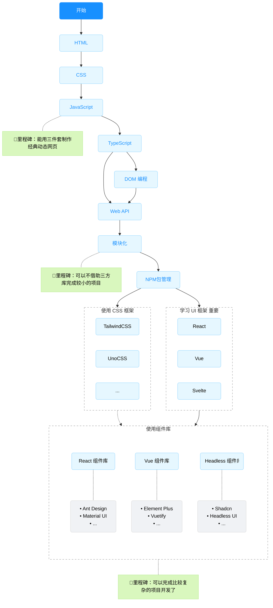

# 前端学习路径

<Linkcard 
url='https://www.bilibili.com/video/BV1BT4y1W7Aw/?p=8&share_source=copy_web&vd_source=d0caeb97a7ff1b5ffa5a2694d33664ae'
title="图表来源" 
description="现代前端开发学习路线" 
logo="https://zh.minecraft.wiki/images/Oak_Standing_Sign_JE2_BE2.png?6d673"/>