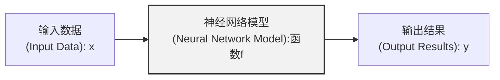

# 神经网络基础知识

### AI工具
1. Gemini（推荐，免费）
https://aistudio.google.com/
2. GPT（国内的镜像网站）
https://chat1.sorryios.chat/pastel#/register?i=909EE

## 引入

通过已知的数据与结果的映射关系训练一个神经网络，使得这个模型在遇到新的数据时能够预测出正确的结果。

`推理阶段`

`训练阶段`

## 神经网络概述

## 神经网络训练的原理

## 搭建一个最简单的神经网络

