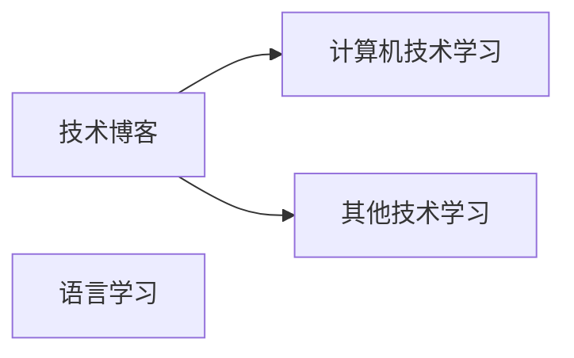

# 写在开始
::: tip 关于文笔
自打高中毕业以来很少撰文，遣词造句能力明显弱化。  
具体内容迄待日后修改。
:::
## 关于网站
### 建站原因
2025年暑假期间我的一位朋友与我分享了一个他自己搭建的网站，我看了觉得很符合我对一个个人站点的设想，于是便萌生了自己也搭建一个的想法。
### 探索过程
本来我计划从 HTML、CSS、JavaScript 等传统手段来进行学习并且搭建网站。但过程中我发现可以直接基于 vuepress 或者 vitepress 这样现成的架构来直接搭建框架，然后直接在里面书写文档，这正合我意。
<br>

我起初的计划是通过 vuepress 搭建网站，在过程中偶然发现了 vitepress 这个静态网站生成器。
在探索过程中我又正好遇到了一个让我觉得非常心动的网站模板 [ VitePress 快速上手中文教程 ](https://vitepress.yiov.top/),基于此我便搭建了第一个网站框架 [ XUCHENXU2004's Blog ](https://www.xuchenxu2004.com/)。
<br>

### 网站架构
对于网站架构，我设想搭建一个将**个人博客**与**知识库**整合的站点，而我起初模仿搭建的现有开源框架并不能满足个人博客的需求，仅仅能够作为一个文档库来使用。
这时[ Vitepress Theme Teek ](https://vp.teek.top/) 这个站点刚好满足了我的需求。该站点主要提供了个人博客结合知识库模式丰富的网站插件，深得我心。
后续的搭建将主要参考该项目。

### 网站样式
对于网站样式，我计划先按照只有**中文**的版本，多语言功能后续会添加。
部分插件我是直接拿过来就用的，后续需要对于源码进行阅读并且学习其中原理。
后续可以对插件代码进行个性化配置，丰富主页样式，并且添加一些注释方便自己阅读。

### 网站目的
建站的目的一大部分原因是对个人的知识进行库存化管理，因此该网站应当分为几个大的板块。
技术博客部分


### 目录结构
本节参考[ Vitepress Theme Teek ](https://vp.teek.top/)的[ 结构化目录 ](https://vp.teek.top/guide/directory-structure.html#%E7%BB%93%E6%9E%84%E5%8C%96%E7%9B%AE%E5%BD%95)部分。

```sh [结构化目录]
docs
│ (不参与数据生成)
├─ .vitepress
├─ index.md
├─ package.json
├─ public
│
│  (以下部分参与数据生成)
│  (以下为我暂时的目录设想)
├─ 01.指南
│  │  index.md
│  ├─ 01.指南 - 使用
│  │  ├── 04.使用 - 登录认证.md
│  │  ├── 07.使用 - 权限认证.md
│  │  ├── 10.使用 - 登出下线.md
│  │  └─ 99.三级目录测试
│  │  │  ├── 01.测试1.md
│  │  │  ├── 03.测试2.md
│  │  │  ├── index.md
│  │  │  │   └─ 99.四级目录测试
│  │  │  │   ├── 01.测试1.md
│  │  │  │   ├── 03.测试2.md
│  │  │  │   ├── index.md
│  ├─ 05.指南 - 环境集成
│  │  ├── 04.环境集成 - Spring Boot.md
│  │  ├── 07.环境集成 - Spring WebFlux.md
│  │  ├── 99.环境集成 - 上下文组件开发指南.md
│  └─ 10.指南 - 插件
│  │  ├── 04.插件 - 持久层集成 Redis.md
│  │  ├── 07.插件 - 持久层拓展.md
│  │  ├── 10.插件 - AOP 注解鉴权.md
├─ 05.设计
│  │  00.目录.md
│  ├─ 01.设计 - 思路
│  │  │  01.设计 - 思路设计.md
│  │  │  04.设计 - 模块设计.md
│  │  │  07.设计 - 术语说明.md
│  ├─ 03.设计 - Helpers
│  │  ├── 01.设计 - Helpers 说明.md
│  │  ├── 07.设计 - 账号登录.md
│  │  ├── 10.设计 - 账号登出.md
```